# Local Environment Setup
### Prerequisites
1. Docker Desktop installed
2. MySQL Workbench installed

### Starting DB, Frontend, and Backend
1. Start Docker Desktop
2. Click run on project_3c:
   1. If you do not see this in Docker Desktop, see the section titled "Generating project_3c Container"

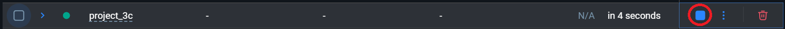

3. Update your .env file to use local environment variables
4. From the Project_3c root folder, cd into the backend folder
   1. Type ./gradlew bootRun in the terminal and press enter to start the backend on localhost:8080
5. From a new terminal window, navigate to Project_3c root folder and cd into the frontend folder
   1. Type npm run dev in the terminal and press enter to start the frontend on localhost:3000

### See Database Changes
1. Open MySQL Workbench
2. Click on boggle_db connection
   1. If you do not see this connection, see the section titled "Connecting to boggle_db"

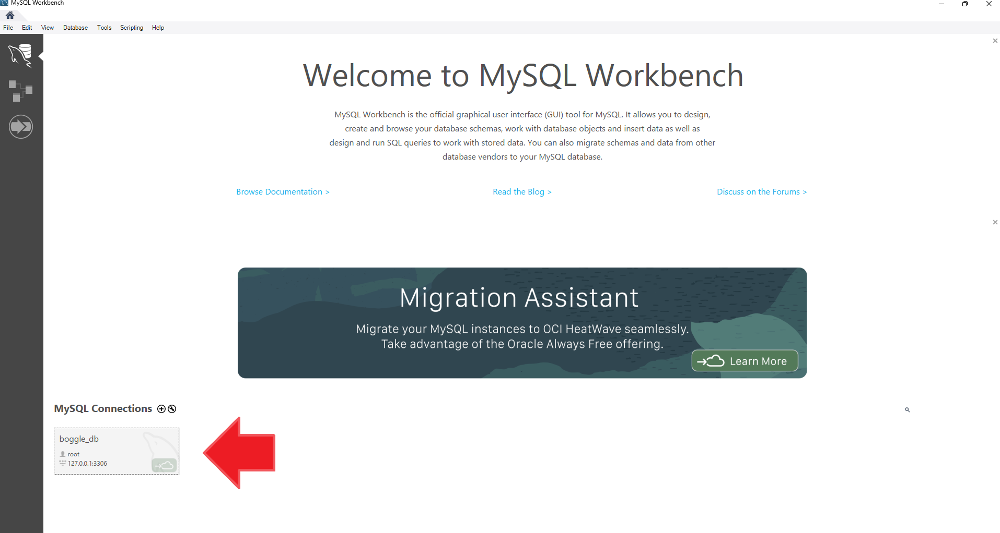

3. Create a new SQL script

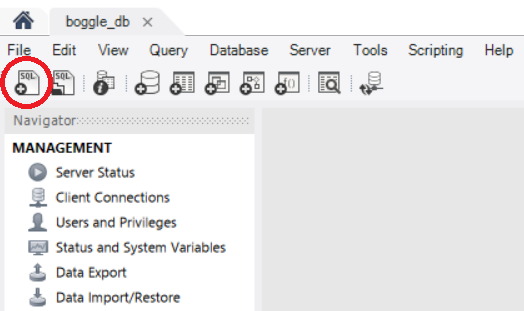

4. Run "USE boggle_db;" and click on the lightning icon

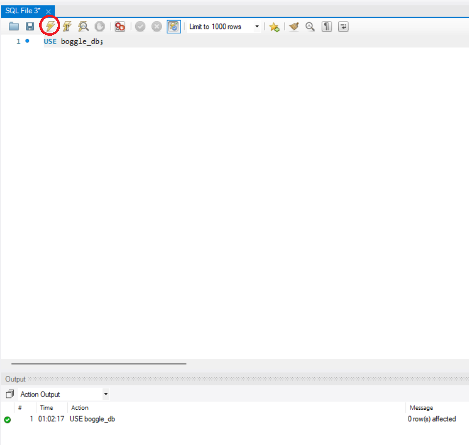

   1. On success, you should see a check mark in the bottom pane
   2. From this point, you can query the tables like normal
   3. To see a list of tables, use the query "SHOW TABLES;"

# Known Issues
### Generating project_3c Container
- If you do not see project_3c container in Docker desktop, navigate in your terminal to the Project_3c root directory
- Once here, run "docker compose up". (If this doesn't work, you probably don't have Docker Desktop open)
  - This will create project_3c for you in Docker Desktop and automatically run the container
  - When you are finished using the container for your development session, you can press the stop button to stop running the container
  - On future local development sessions, you now can follow the same process of running the project_3c container as detailed in the "Setup" section of this file
- If you ever lose the project_3c container, you can always run docker compose up from the Project_3c root directory again to regenerate it

### Connecting to boggle_db
- If you don't have any MySQL Connections in MySQL workbench, follow the steps in this section

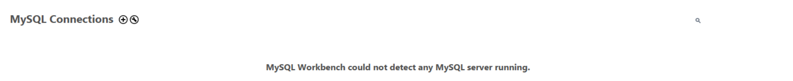

1. Click the plus icon to create a new connection

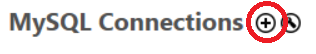

2. Enter the following info into the popup window

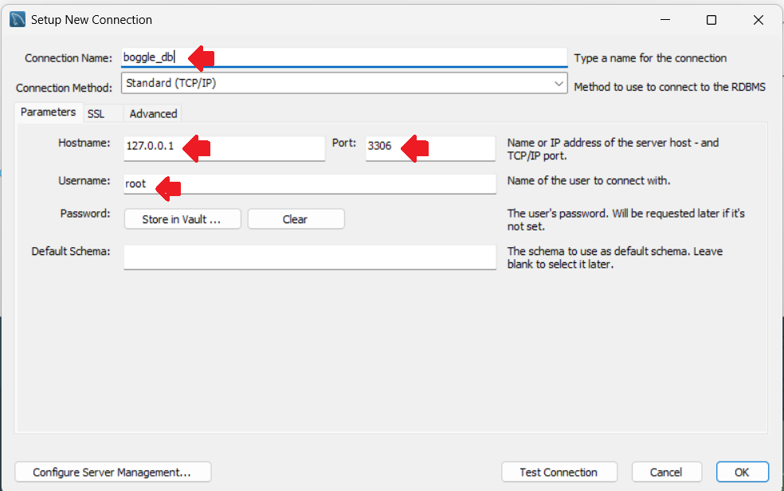

3. Click on the "Store in Vault ..."
   1. The password is "secret" with no quotes
4. Click "OK" after entering the password and then click "OK" again to finish the connection setup

# Local Setup with Google Cloud Hosted DB
### Setup
1. Go to cloud.google.com
2. Click on "Console" in the upper right

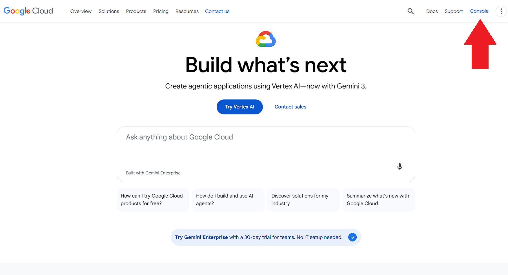

3. Select cs506-project3c in the upper left
   1. You should already be added to this project. If you are not, contact someone in the group.

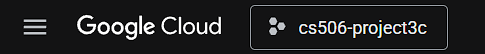

4. Click the hamburger icon and navigate to the "Cloud SQL" tab

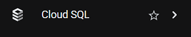

5. Navigate to the "Instances" tab on the left
6. Click on cs506-database

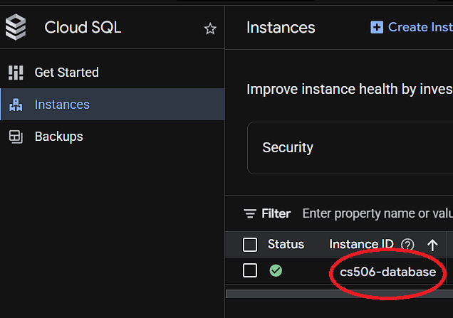

7. Navigate to the "Connections" tab on the left and then click on "Networking"

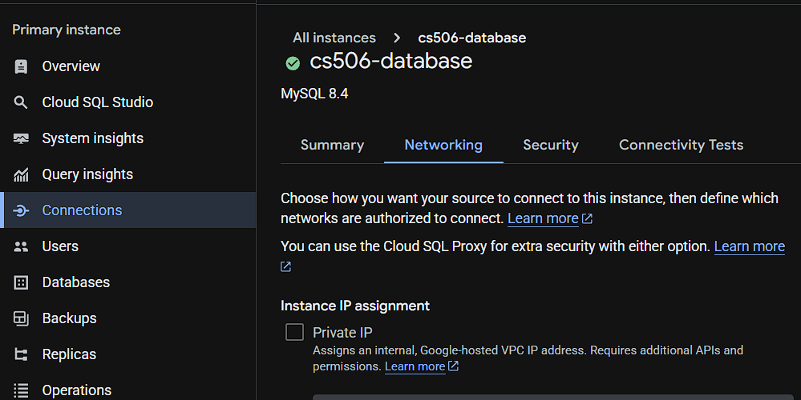

8. Under "Authorized networks", click Add a network. Give the network a name of your choosing and click "Use My IP" for the IP range.

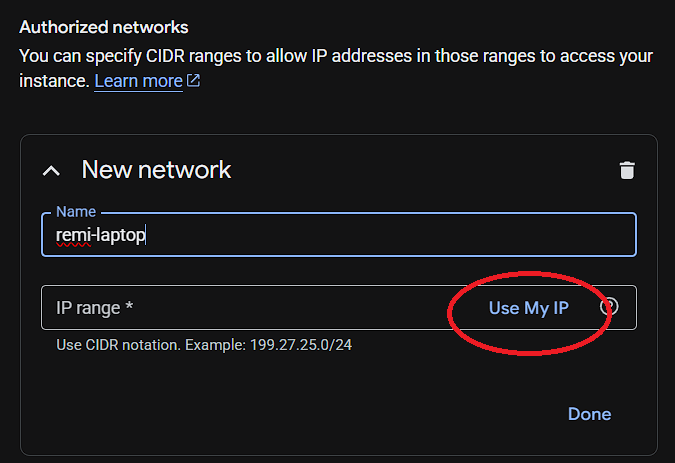

### See Database Changes
1. Click on "Cloud SQL Studio"

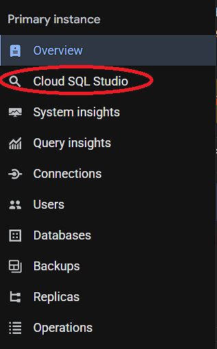

2. To log in, use boggle_db as the Database. Click the "Built-in database authentication" circle. User should be "project-member". The password should be the same password from .env.
3. Create a new query with the plus icon, type "USE boggle_db;", and click the "Run" button. You can then execute queries like normal. To see a list of tables in the db, look in the sidebar to the left or use the query "SHOW TABLES;"

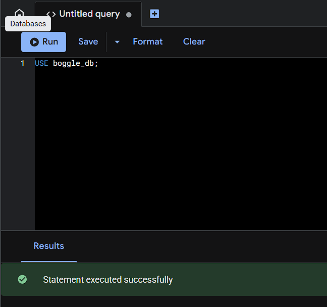

### Running Backend, Frontend With Google Cloud Hosted DB
1. Update your .env file to use prod environment variables
2. Navigate to the Project_3c folder and cd into the backend folder
   1. Run ./gradlew bootRun to start up the backend on localhost:8080
3. Navigate to the Project_3c folder in a new terminal session and cd into the frontend folder
   1. Run npm run dev to start up the frontend on localhost:3000