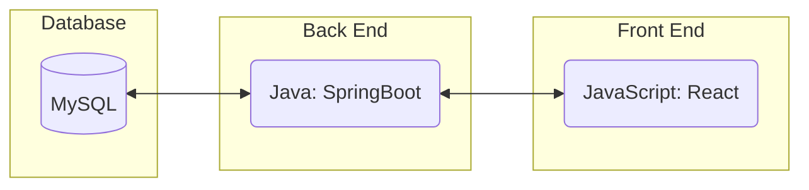
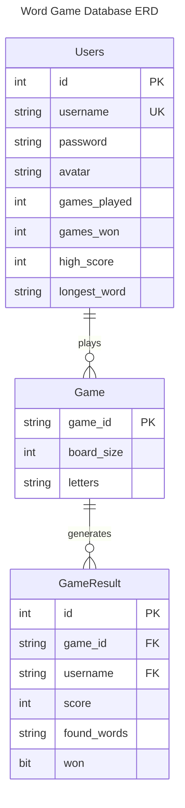
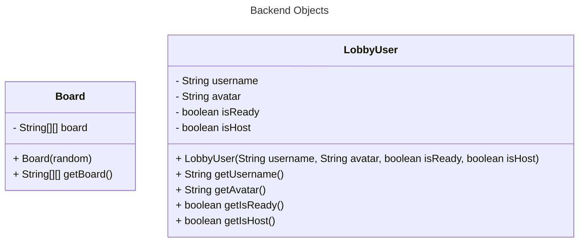
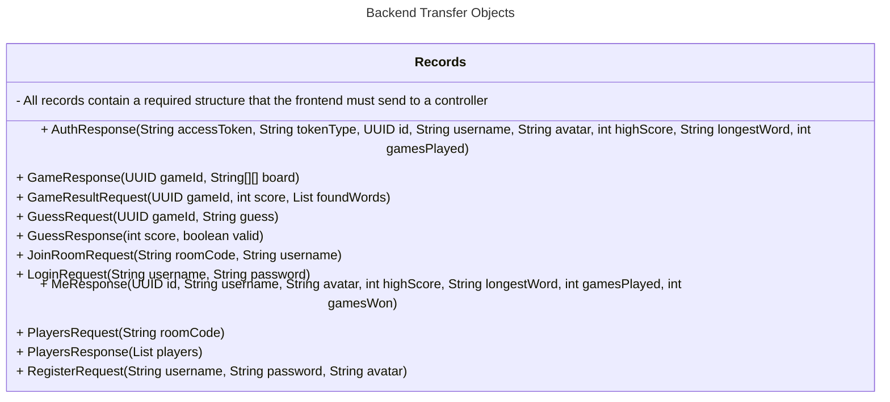
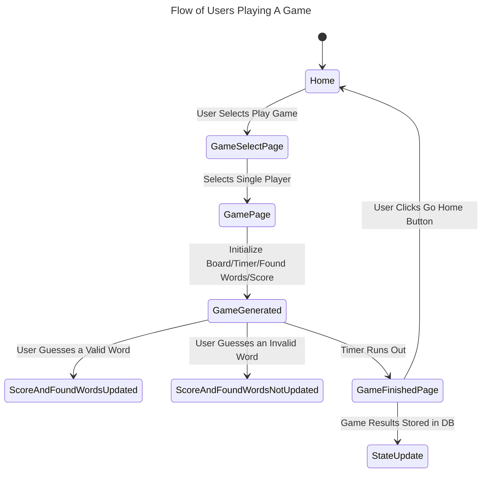
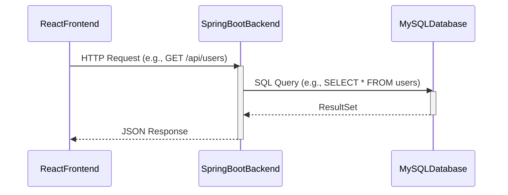
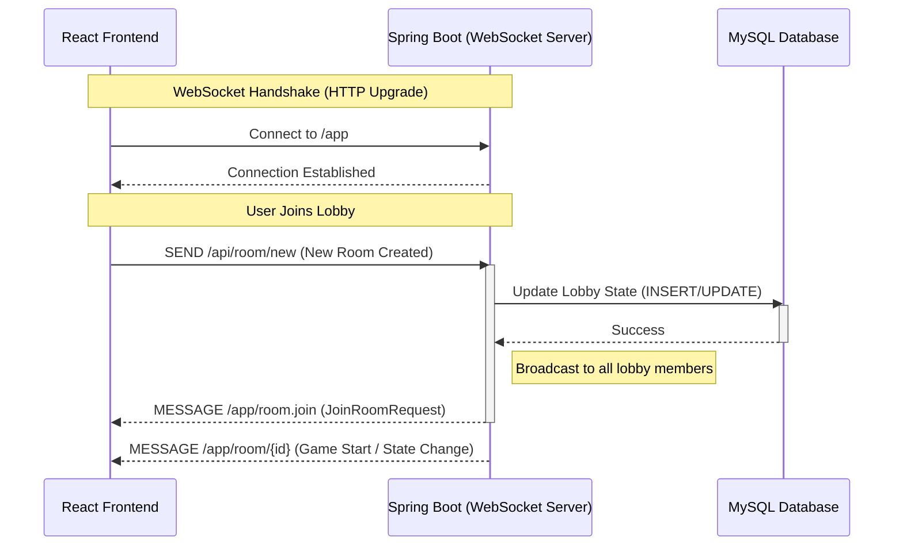

## Boggle Game (Project_3c)
<!--The name of your team.-->

### Project Abstract

This project is a team-based effort to develop a real-time multiplayer Boggle application where users can compete against each other online. Our team is building a system that randomly shuffles and lays out letter dice to generate a unique board for each round, provides an interactive interface for players to submit words, and automatically validates and scores entries using a shared dictionary. At the end of each game, the app will display all players’ word lists, calculate scores, and highlight unique words. Beyond the core gameplay, we plan to explore additional features such as customizable game settings, user accounts with tracked statistics, AI opponents, and the ability to design and share custom boards.

<!--A one paragraph summary of what the software will do.-->

### Customer

Generally, the customer for this software is a casual gamer that, in specific, likes to play word games/puzzles.

<!--A brief description of the customer for this software, both in general (the population who might eventually use such a system) and specifically for this document (the customer(s) who informed this document). Every project will have a customer from the CS506 instructional staff. Requirements should not be derived simply from discussion among team members. Ideally your customer should not only talk to you about requirements but also be excited later in the semester to use the system.-->

### Specification

<!--A detailed specification of the system. UML, or other diagrams, such as finite automata, or other appropriate specification formalisms, are encouraged over natural language.-->

<!--Include sections, for example, illustrating the database architecture (with, for example, an ERD).-->

<!--Included below are some sample diagrams, including some example tech stack diagrams.-->

#### Technology Stack (Finalized)

#### Database

#### Class Diagram

#### Behavior

#### Sequence Diagram for Most of App

#### Sequence Diagram for Multiplayer

### Standards & Conventions

<!--This is a link to a seperate coding conventions document / style guide-->
[Style Guide & Conventions](STYLE.md)
