# Boggle Woggle

A full-stack multiplayer Boggle game built with React, Spring Boot, MySQL, and WebSockets.

## Overview

Boggle Woggle is a real-time word game where users can play singleplayer or compete against others in multiplayer lobbies. The app generates randomized Boggle boards, validates submitted words, tracks player statistics, and supports real-time multiplayer gameplay through WebSockets. Built as part of a five-person software engineering team using Agile development practices, Git workflows, code reviews, and CI/CD pipelines.

## Notable Contributions

- Lead UI/UX designer in Pre-Production/Concept Art
- Implemented a global audio system using React Context
- Added menu music, gameplay music, and sound effects
- Implemented separate master, music, and SFX volume controls
- Added winner/loser multiplayer audio feedback
- Integrated audio throughout the application UI
- Resolved merge conflicts and integrated multiplayer updates

## Screenshots

### Home Screen
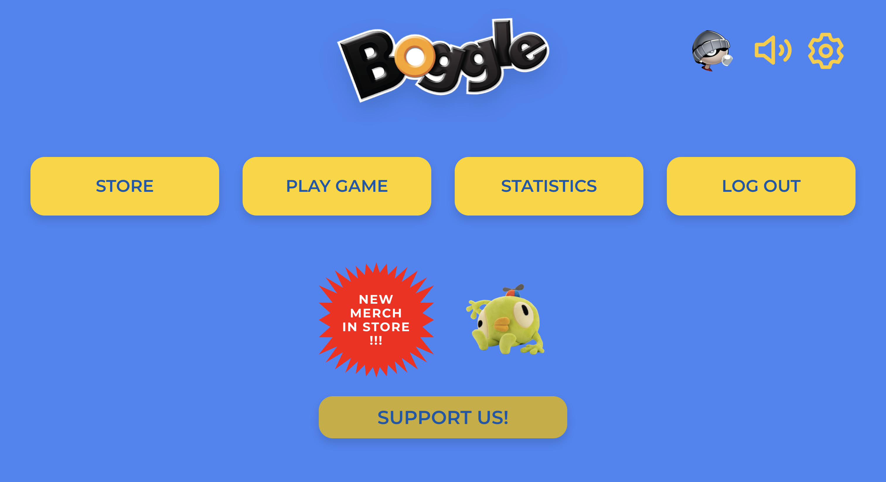

### Login Screen
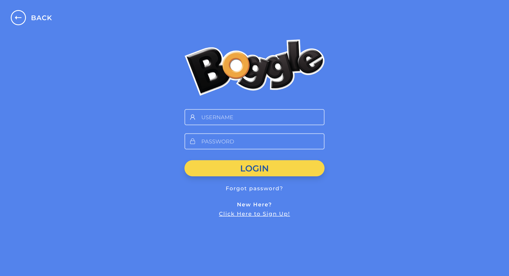

### Multiplayer Lobby
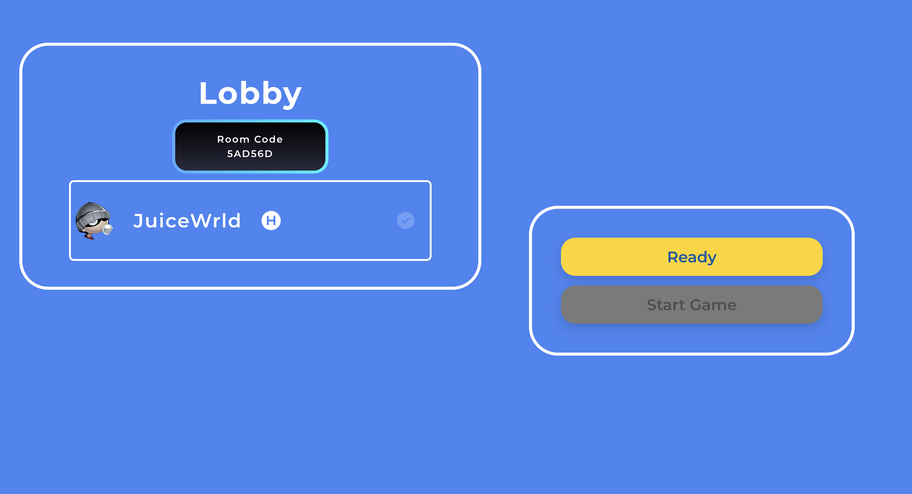

### Gameplay
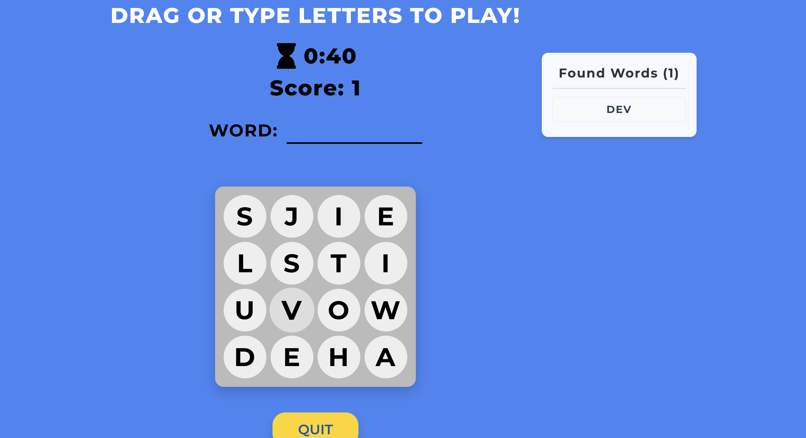

### Player Statistics
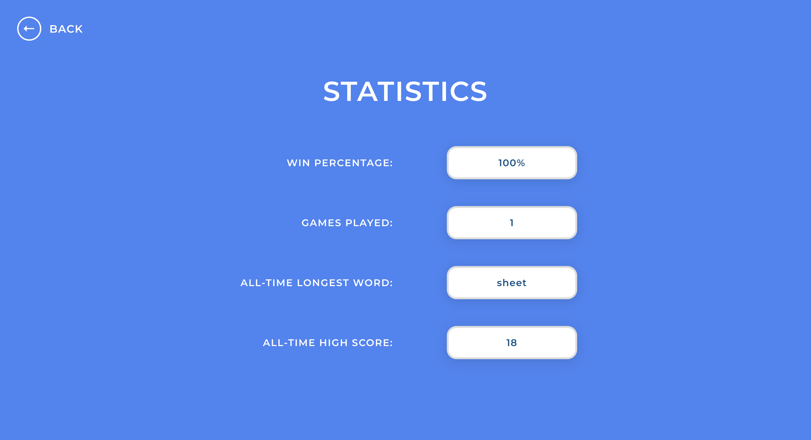

### Audio Settings
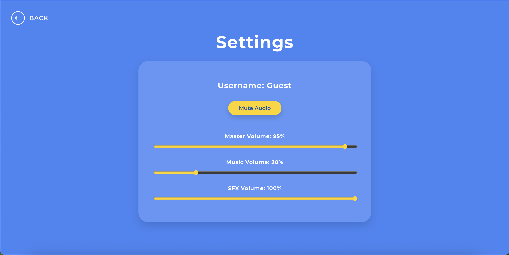

## Demo

Video walkthrough: [YouTube Link]

## Tech Stack

- React
- Spring Boot
- MySQL
- WebSockets
- JWT Authentication

## Running Locally

### Backend

```bash
cd backend
./gradlew bootRun
```

### Frontend

```bash
cd frontend
npm install
npm run dev
```

## Technical Documentation

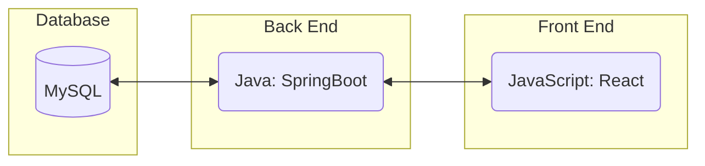

#### Database

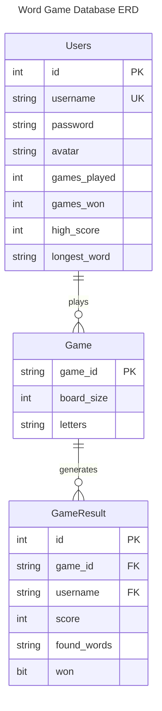

#### Class Diagram

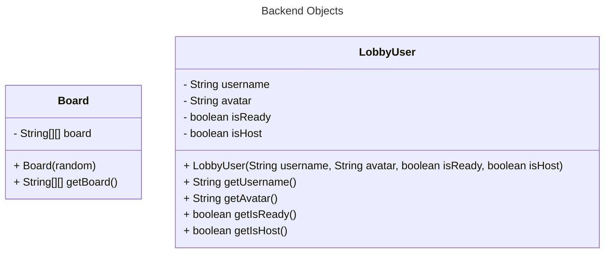

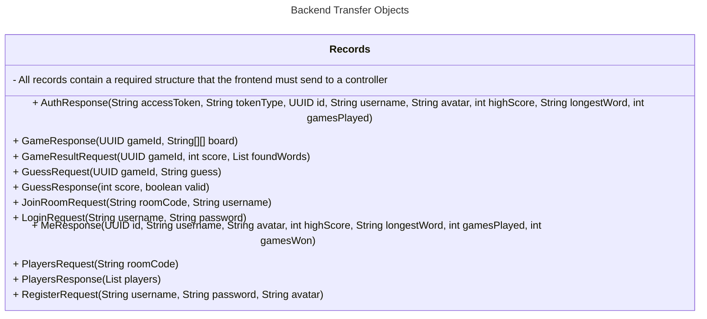

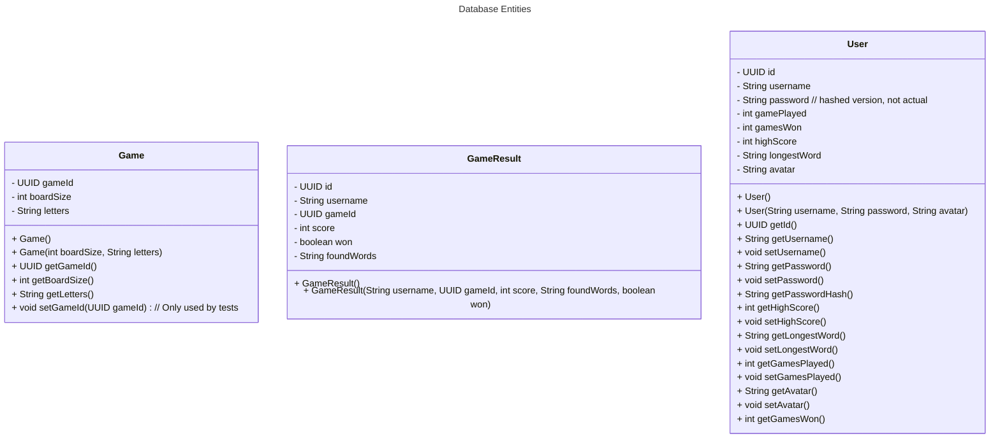


#### Behavior

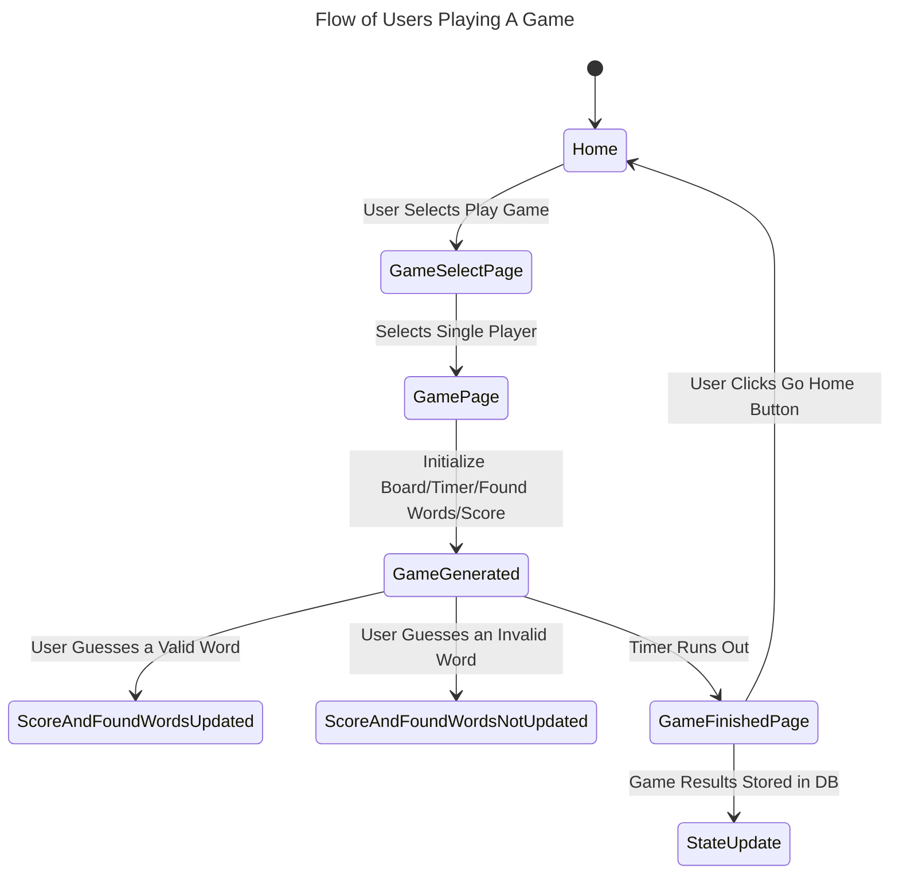

#### Sequence Diagram for Most of App

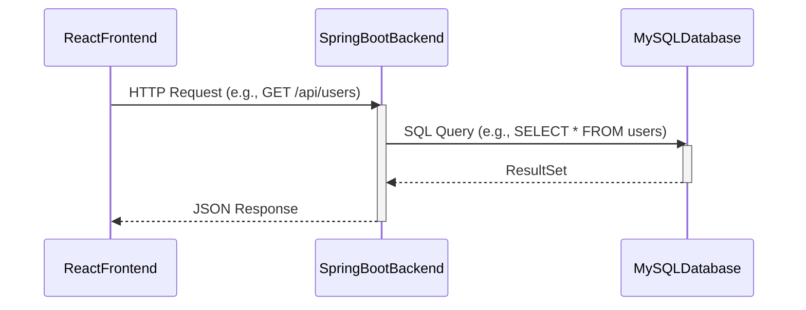

#### Sequence Diagram for Multiplayer

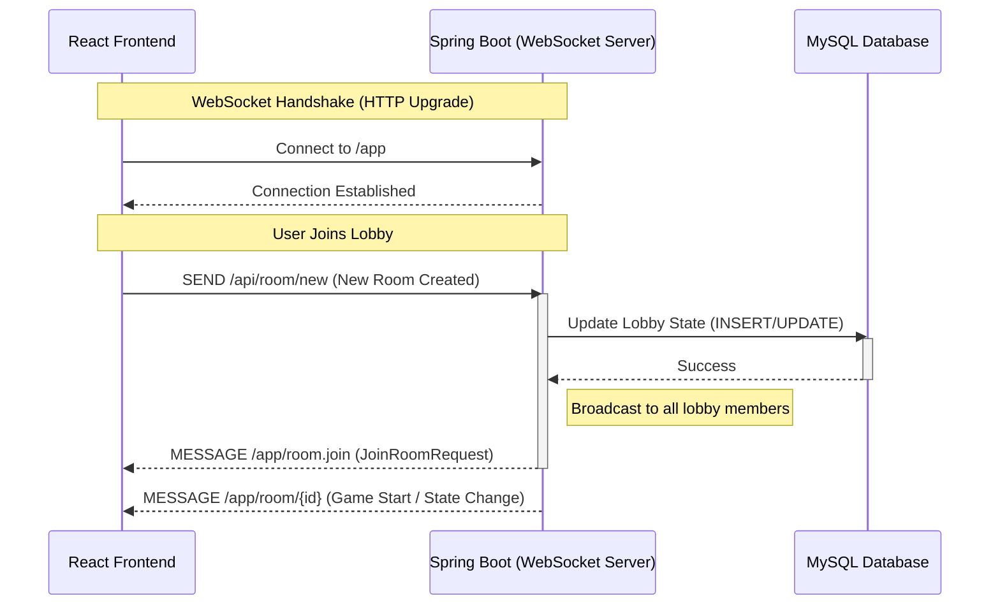

### Additional Documentation

[Style Guide & Conventions](STYLE.md)
